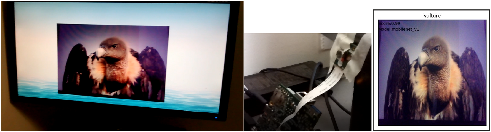
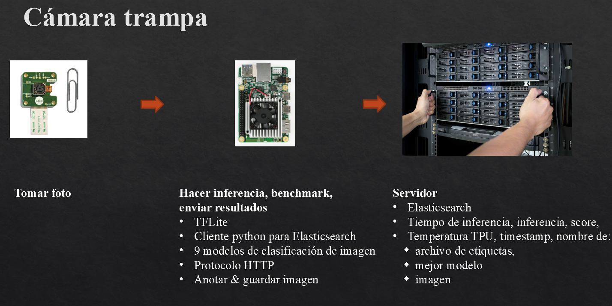

# Camera trap
A [camera trap](https://www.worldwildlife.org/initiatives/camera-traps) is a camera, that is automatically triggered by a change in some activity in its vicinity, like presence of animals (environmental monitoring). It is typically equipped with a motion sensor, for example a passive infrared (PIR) sensor or an active infrared (AIR) sensor using an infrared light beam.

It can also be used in smart city applications: 
* Counting humans: in a high security environment, when sound or movement is detected, the camera will turn on to take a photo, and an alert with the number of people will be sent
  to the server.
* Fire detection: when a change in temperature is detected, the camera will activate to verify if there is a risk of fire. If it is the case, an alert will be sent to a server.

# Pre-requisites
* [Google Coral devboard](https://coral.ai/products/dev-board)
* [Google Coral camera](https://coral.ai/products/camera/)
* Computer with Elasticsearch
* TFlite
* Python
* [Models](https://coral.ai/models/image-classification/)
  All the models that use the ILSVRC2012 dataset.
  * EfficientNet: L, M, S
  * Inception: V1, V2, V3, V4
  * MobileNet: V1, V2

# How does this Proof-of-Concept work?
1. A photo is taken when an event happens (for the moment, when the spacebar is pressed)
2. Recognize taken photo using 9 classification models which are within Coral devboard
3. Benchmark the classification models and pick the one with the highest accuracy (in the future with a chosen probability threshold)
4. Send inference result, classification models' name and TPU’s temperature to remote computer
5. Visualize results within a dashboard, using Elasticsearch

# Notes
"classify.py" and "snapshot.py" were written by Google
